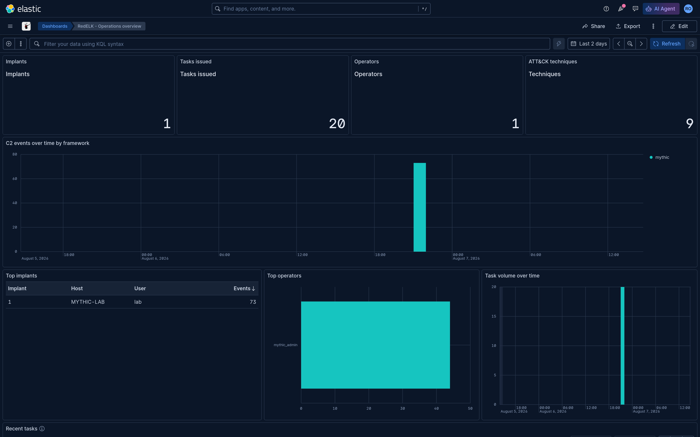
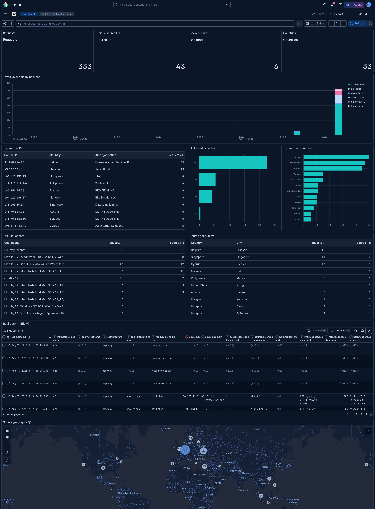

[](https://github.com/outflanknl/RedELK/actions/workflows/docker-images.yml)
[](https://github.com/outflanknl/RedELK/actions/workflows/python.yml)
[](https://github.com/outflanknl/RedELK/actions/workflows/validate.yml)

# RedELK

The Red Team's SIEM. RedELK collects the logs of your C2 servers and your redirectors into one
Elasticsearch cluster, enriches them, and alarms you when the blue team starts poking at your
infrastructure.

1. **Operational oversight.** Every teamserver's implant traffic, tasks, screenshots, keystrokes,
   downloads and credentials in one searchable place, across scenarios, teamservers, operators and
   months. Useful during the operation and indispensable when writing the report.
2. **Spot the blue team.** Every redirector's traffic log in the same place, enriched with your own
   IP lists, GreyNoise, Tor exit nodes and domain categorisation, so a query can tell you that
   somebody is walking your infrastructure.





## Quickstart

RedELK v3 is one configuration file and one command.

```sh
git clone https://github.com/outflanknl/RedELK.git && cd RedELK
cp redelk.yml.example redelk.yml       # or: ./redelkctl init
$EDITOR redelk.yml                     # at minimum: server.hostnames, c2_servers, redirectors
sudo ./redelkctl install               # generate everything and start the stack
sudo ./redelkctl package               # build the per-host shipper packages
```

Then deploy one package per redirector / file-based C2 server:

```sh
scp build/packages/redir1.tar.gz redir1:
ssh redir1 'tar xzf redir1.tar.gz && cd redir1 && sudo ./install.py'
```

Check the result with `./redelkctl doctor`. Kibana is on `https://<server.hostnames[0]>/`, user
`redelk`, password from `./redelkctl secrets --reveal`.

Full walkthrough: [docs/installation.md](docs/installation.md). For many hosts, [`ansible/`](ansible/README.md)
drives the same `redelk.yml` and `redelkctl` remotely.

## System requirements

**RedELK server**

| | |
|---|---|
| OS | Debian 11+ / Ubuntu 22.04+ (any Linux with Docker works; `redelkctl` only needs Python 3.10+) |
| Privileges | root, or a user in the `docker` group. Root is needed once to raise `vm.max_map_count` |
| Docker | Docker Engine with the **Compose v2 plugin** (`docker compose`, not `docker-compose`) |
| RAM | `profile: full` >= 8 GB, `profile: limited` >= 4 GB. `redelkctl install` warns below that |
| Disk | Sized for your retention. Elasticsearch turns indices read-only at 95% disk usage |
| Python | 3.10 or newer for `./redelkctl`; it bootstraps its own virtualenv in `.redelk-venv/` |

The `full` profile adds Jupyter notebooks and BloodHound CE (Neo4j + Postgres) to the Elastic
stack. `limited` runs Elasticsearch, Kibana, Logstash, nginx and the RedELK daemon only.

**Redirectors and file-based C2 servers**: Debian/Ubuntu with `apt`. The generated package
installs Filebeat pinned to the server's Elastic version. On other distributions install Filebeat
yourself and copy the package's `filebeat.yml`, `inputs.d/` and `certs/` into `/etc/filebeat`.

## Supported C2 frameworks and redirectors

Defined in [`tools/redelk_setup/schema.py`](tools/redelk_setup/schema.py) (`C2_TYPES`).

| `type:` | Framework | How data arrives |
|---|---|---|
| `cobaltstrike` | Cobalt Strike | Filebeat on the teamserver + rsync of screenshots/downloads/keystrokes |
| `poshc2` | PoshC2 | Filebeat on the teamserver |
| `sliver` | Sliver | Filebeat on the teamserver (`audit.json`) |
| `outflankstage1` | Outflank Stage1 C2 | Filebeat on the teamserver + rsync of downloads |
| `mythic` | Mythic | **API** - the RedELK server polls it, credentials in `redelk.yml` |
| `outflankc2` | Outflank C2 | **API** - the RedELK server polls it, credentials in `redelk.yml` |

Redirectors: `haproxy`, `nginx`, `apache`. Example configurations that produce the log format the
Logstash filters expect are in [`example-data-and-configs/`](example-data-and-configs/).

Details and limitations per framework: [docs/c2-integrations.md](docs/c2-integrations.md).

## Credentials

`redelk.yml` holds no generated passwords. Everything RedELK generates lands in
**`redelk.secrets.yml`** (mode `0600`, git-ignored) next to it, created on first run and never
regenerated once written.

```sh
./redelkctl secrets            # list the credentials, redacted
./redelkctl secrets --reveal   # print them in full
```

The `redelk` account is both the nginx basic-auth user and the Kibana user. API tokens for Mythic,
Outflank C2 and the threat-intel services are values *you* put in `redelk.yml` - keep that file out
of git too (it is git-ignored by default).

## Ports

Published by the RedELK server:

| Port | Bound to | Service |
|---|---|---|
| 80/tcp | all interfaces | nginx: redirect to https + Let's Encrypt HTTP-01 challenge |
| 443/tcp | all interfaces | nginx: Kibana, `/c2logs`, `/jupyter` (full profile). Basic auth + TLS |
| 5044/tcp | all interfaces | Logstash beats input. TLS, client certificate required by default |
| 8443/tcp | `server.bind.bloodhound` (default 127.0.0.1) | BloodHound CE, full profile |
| 9200/tcp | `server.bind.elasticsearch` (default 127.0.0.1) | Elasticsearch |
| 5601/tcp | `server.bind.kibana` (default 127.0.0.1) | Kibana (reach it through nginx instead) |
| 7474, 7687/tcp | `server.bind.neo4j` (default 127.0.0.1) | Neo4j, full profile |

Outbound, the RedELK server connects to your C2 servers on ssh (`c2_servers[].ssh.port`, default
22) for file sync, and to the Mythic / Outflank C2 APIs. Redirectors and C2 servers only need to
reach port 5044.

## Documentation

Everything is in [`docs/`](docs/README.md):

- [Installation](docs/installation.md) - server, redirectors and C2 servers, step by step
- [Configuration reference](docs/configuration.md) - every key in `redelk.yml`
- [Architecture](docs/architecture.md) - the data path, container by container, index by index
- [C2 integrations](docs/c2-integrations.md) - per framework: what is collected, what is not
- [Adding a C2](docs/adding-a-c2.md) - the end-to-end checklist
- [TTP tracking](docs/ttp-tracking.md) - MITRE ATT&CK enrichment and the Navigator export
- [Alarms and enrichment](docs/alarms.md) - every module, what it needs
- [Notifications](docs/notifications.md) - e-mail, Slack, MS Teams
- [Operations](docs/operations.md) - day-2: backups, certificate rotation, retention
- [Troubleshooting](docs/troubleshooting.md) - the failures that actually happen
- [Upgrading from v2](docs/upgrading.md) - read this before you touch a v2 install
- [Security model](docs/security.md) - who can reach what, and what RedELK does not collect

Contributing: [CONTRIBUTING.md](CONTRIBUTING.md). Reporting a vulnerability:
[SECURITY.md](SECURITY.md). Changes: [CHANGELOG.md](CHANGELOG.md).

## Background

- Blog part 1: [Why we need RedELK](https://outflank.nl/blog/2019/02/14/introducing-redelk-part-1-why-we-need-it/)
- Blog part 2: [Getting you up and running](https://outflank.nl/blog/2020/02/28/redelk-part-2-getting-you-up-and-running/)
- Blog part 3: [Achieving operational oversight](https://outflank.nl/blog/2020/04/07/redelk-part-3-achieving-operational-oversight/)
- SANS Hackfest 2020: Super charge your Red Team with RedELK [video](https://www.youtube.com/watch?v=24pVnDSSOLY) and [slides](https://github.com/outflanknl/Presentations/blob/master/SANSHackFest2020_Smeets_SuperchargeYourRedTeamwithRedELK.pdf)
- Hack in Paris 2019: Who watches the Watchmen [video](https://www.youtube.com/watch?v=ZezBCAUax6c) and [slides](https://github.com/outflanknl/Presentations/blob/master/HackInParis2019_WhoWatchesTheWatchmen_Bergman-Smeetsfinal.pdf)
- x33fcon 2019: Catching Blue Team OPSEC failures [video](https://www.youtube.com/watch?v=-CNMgh0yJag) and [slides](https://github.com/outflanknl/Presentations/blob/master/x33fcon2019_OutOfTheBlue-CatchingBlueTeamOPSECFailures_publicversion.pdf)
- BruCon 2018: Using Blue Team techniques in Red Team ops [video](https://www.youtube.com/watch?v=OjtftdPts4g) and [slides](https://github.com/outflanknl/Presentations/blob/master/MirrorOnTheWall_BruCon2018_UsingBlueTeamTechniquesinRedTeamOps_Bergman-Smeets_FINAL.pdf)

## Conceptual overview


## Authors and contribution

This project is developed and maintained by:

- Marc Smeets (@MarcOverIP on [Github](https://github.com/MarcOverIP) and [Twitter](https://twitter.com/MarcOverIP))
- Mark Bergman (@xychix on [Github](https://github.com/xychix) and [Twitter](https://twitter.com/xychix))
- Lorenzo Bernardi (@fastlorenzo on [Github](https://github.com/fastlorenzo) and [Twitter](https://twitter.com/fastlorenzo))
- Geert Smelt (@Anthirian on [GitHub](https://github.com/Anthirian), @sme.lt on [BlueSky](https://bsky.app/profile/sme.lt) and @gasmelt on [Mastodon](https://infosec.exchange/@gasmelt))

We welcome contributions! Contributions can be both in code, as well as in ideas you might have for
further development, alarms, usability improvements, etc.
