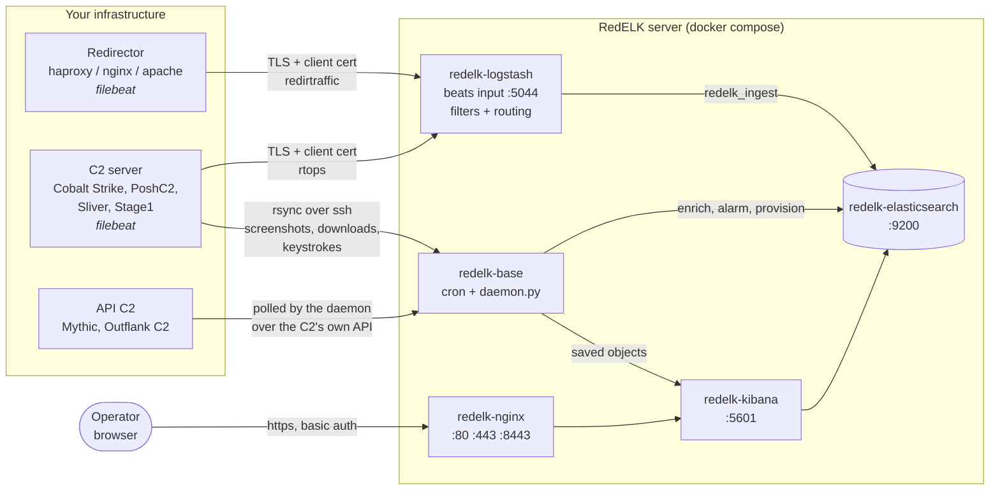

# Architecture

## The data path



Two ingestion styles:

- **Push (files).** Filebeat on the redirector or C2 server tails log files and ships them to the
  Logstash beats input over TLS. Artefacts that are not log lines - screenshots, downloaded files,
  keystroke files - are pulled separately by the RedELK server over ssh/rsync into
  `/var/www/html/c2logs/<hostname>/`, which nginx serves at `/c2logs`.
- **Pull (API).** For Mythic and Outflank C2 nothing is installed on the C2 server. The RedELK
  daemon polls the framework's own API on `api.poll_interval` and writes the same `rtops-*`
  documents that the Logstash filters would have produced.

## Containers

Defined in [`elkserver/docker-compose.yml`](../elkserver/docker-compose.yml). There is exactly one
compose file; optional services are gated behind compose profiles (`full`, `letsencrypt`) that
`redelkctl` sets in `elkserver/.env`.

| Service | Container | Image | Profile | What it does |
|---|---|---|---|---|
| `elasticsearch` | `redelk-elasticsearch` | `docker.elastic.co/elasticsearch/elasticsearch:${ELASTIC_VERSION}` | always | Single-node cluster `redelk-cluster`, security on, TLS on both HTTP and transport with RedELK-CA certificates. |
| `logstash` | `redelk-logstash` | `docker.elastic.co/logstash/logstash:${ELASTIC_VERSION}` | always | One pipeline (`redelk-pipeline`) reading `redelk-main/conf.d`. Beats input on 5044. |
| `base` | `redelk-base` | `${REDELK_IMAGE_REPO}/redelk-base:${REDELK_IMAGE_TAG}` | always | Provisions Elasticsearch and Kibana, then runs cron: `daemon.py` every minute, the rsync jobs, thumbnailing, Tor/rogue-domain refreshes. |
| `kibana` | `redelk-kibana` | `docker.elastic.co/kibana/kibana:${ELASTIC_VERSION}` | always | The UI. Waits for `base` to be healthy, because it cannot authenticate before its service account password is set. |
| `nginx` | `redelk-nginx` | `nginx:1.29-alpine` | always | TLS + basic auth reverse proxy in front of Kibana, `/c2logs`, `/jupyter`, and BloodHound on 8443. |
| `certbot` | `redelk-certbot` | `certbot/certbot` | `letsencrypt` | Renews the Let's Encrypt certificate every 12 hours through the shared webroot. |
| `jupyter` | `redelk-jupyter` | `${REDELK_IMAGE_REPO}/redelk-jupyter` | `full` | Notebooks against the RedELK data, proxied at `/jupyter`. |
| `bloodhound` | `redelk-bloodhound-app` | `specterops/bloodhound` | `full` | BloodHound CE. |
| `bloodhound-neo4j` | `redelk-bloodhound-neo4j` | `neo4j:5-community` | `full` | BloodHound's graph database. |
| `bloodhound-postgres` | `redelk-bloodhound-postgres` | `postgres:17-alpine` | `full` | BloodHound's relational store. |

RedELK v3 builds only two images of its own (`redelk-base`, `redelk-jupyter`). Elasticsearch,
Kibana and Logstash run the stock Elastic images; the custom `redelk-elasticsearch`,
`redelk-kibana` and `redelk-logstash` images of v2 were deleted, and everything they did is now
either an environment variable or a bind mount.

Named volumes: `es_data`, `kibana_data`, `bloodhound_data`, `postgres_data`, `redelk_state`.
Everything else is a bind mount under `elkserver/mounts/`, so you can change a Logstash filter or a
list without rebuilding an image.

## Logstash pipeline

`elkserver/mounts/logstash-config/redelk-main/conf.d/`, executed in filename order:

| File | Role |
|---|---|
| `10-input_filebeat_logstash.conf` | Beats input on 5044. TLS, and `ssl_client_authentication` from `LOGSTASH_CLIENT_AUTH` (`required` whenever `server.tls.mutual_auth` is true). |
| `11-input_localfiles_logstash.conf` | Reads `/var/log/redelk/redteamdomaincheck.txt` produced by the rogue-domain check. |
| `12-input_email_logstash.conf` | Optional IMAP inputs. Every block is commented out on purpose - an `imap` input with an empty host makes Logstash refuse to start. |
| `20/21/22-filter-redir-*` | Parse haproxy, apache and nginx access logs into `redirtraffic`. |
| `23-filter-redir-common` | The IPv6 normalisation, geoip and reverse DNS all three share. Has to keep sorting after 22 - it enriches the fields they grok out. |
| `30-filter-email` | Parses the IMAP events. |
| `50/51/52/53-filter-c2-*` | Parse Outflank Stage1, Cobalt Strike, PoshC2 and Sliver logs into `rtops`. |
| `70-filter-pstools` | Parses PowerShell/PsTools style output embedded in C2 messages. |
| `80-filter-bluecheck*` | Outflank BlueCheck data and the rogue-domain check results. |
| `99-outputs_logstash.conf` | Routes to the index. |

The pipeline is pinned to `pipeline.ecs_compatibility: v1`. Logstash 9.x defaults to v8, which
changes what the beats input and the geoip/useragent/dns filters write - every RedELK filter, index
template and saved object is built against v1.

Routing in `99-outputs`:

| Condition | Index |
|---|---|
| `[infra][log][type] == "rtops"` | `rtops-yyyy.MM.dd` |
| `[infra][log][type] == "redirtraffic"` | `redirtraffic-yyyy.MM.dd` |
| `[infra][log][type] == "email"` | `email-yyyy.MM.dd` |
| `[c2][log][type] == "credentials"` | `credentials-yyyy.MM.dd` |
| `implantsdb` in `[type]`/`[tags]` | `implantsdb` |
| `bluecheck` in `[type]`/`[tags]` | `bluecheck-yyyy.MM.dd` |

All outputs use `manage_template => false`, `ilm_enabled => false` and `data_stream => false`:
`redelk-base` owns the templates and the ILM policy, and RedELK updates documents in place, which
data streams do not allow. The date pattern is `%{+yyyy.MM.dd}` - capital `YYYY` is the ISO
week-year in Java's formatter and writes January documents into the previous year's index.

## Indices

| Index | Written by | Contents |
|---|---|---|
| `rtops-yyyy.MM.dd` | Logstash C2 filters, daemon C2 connectors | Everything a C2 framework logged: implant lifecycle, tasks, input/output, screenshots, keystrokes, downloads, IOCs, events. |
| `redirtraffic-yyyy.MM.dd` | Logstash redirector filters | One document per HTTP request seen by a redirector. |
| `credentials-yyyy.MM.dd` | Logstash (`c2.log.type: credentials`) | Credentials harvested by the C2. |
| `implantsdb` | Logstash clone filter | One document per implant: the current state of each beacon/session. |
| `email-yyyy.MM.dd` | Logstash IMAP input | Mailbox events, when you configure the IMAP inputs. |
| `bluecheck-yyyy.MM.dd` | Logstash | Outflank BlueCheck results and the rogue-domain check. |
| `redelk-iplist-*` | `enrich_synciplists` | The IP lists, synchronised with `/etc/redelk/iplist_*.conf`. |
| `redelk-domainslist-*` | `enrich_syncdomainslists` | The domain lists. |
| `redelk-modules` | `helpers.module_did_run()` | One document per module: last run timestamp, status, hit count, error message. This is what the health dashboard and the interval scheduler read. |

Index templates live in `elkserver/docker/redelk-base/redelkinstalldata/templates/` as composable
index templates plus a `component/` directory (`redelk-ecs-base`, `redelk-common`, `redelk-c2`,
`redelk-threat`, `redelk-lists`). They are installed by `bootstrap.py` on every container
start, component templates first. Legacy `_template` documents are not supported any more -
`bootstrap.py` fails loudly on a template without `index_patterns`.

### Field names

Canonical fields, all mapped in the templates:

- `infra.log.type` (`rtops` | `redirtraffic` | `email`), `infra.attack_scenario`
- `c2.program` (`cobaltstrike` | `poshc2` | `sliver` | `stage1` | `mythic` | `outflankc2`),
  `c2.log.type`, `c2.message`, `c2.operator`, `c2.timestamp`, `c2.operation`, `c2.server`,
  `c2.task.id`, `c2.task.status`, `c2.task.completed`, `c2.command.name`, `c2.command.arguments`
- `c2.log.type` vocabulary: `implant_newimplant`, `implant_newsession`, `implant_checkin`,
  `implant_task`, `implant_taskcomplete`, `implant_input`, `implant_output`, `implant_error`,
  `screenshots`, `keystrokes`, `downloads`, `credentials`, `ioc`, `events`
- `implant.id`, `implant.name`, `implant.task`, `implant.task_id`, `implant.task_parameters`,
  `implant.input`, `implant.output`, `implant.arch`, `implant.sleep`, `implant.checkin`,
  `implant.url`, `implant.operator`, `implant.integrity_level`, `implant.process_user`,
  `implant.external_ip`
- `host.name`, `host.ip_int`, `host.ip_ext`, `host.domain`, `host.os.name`, `host.os.family`,
  `host.architecture`, `user.name`, `user.domain`, `process.pid`, `process.name`
- `file.name`, `file.path`, `file.directory`, `file.size`, `file.hash.md5|sha1|sha256`,
  `file.path_local`, `file.url`, `file.is_screenshot`, `file.is_download`
- `screenshot.file_name`, `screenshot.full`, `screenshot.thumb`, `screenshot.title`,
  `keystrokes.user`, `creds.username`, `creds.credential`, `creds.realm`, `creds.host`,
  `creds.source`, `ioc.type`, `ioc.value`
- `threat.framework`, `threat.technique.id[]`, `threat.technique.name[]`,
  `threat.technique.reference[]`, `threat.tactic.id[]`, `threat.tactic.name[]`,
  `threat.tactic.reference[]` - see [ttp-tracking.md](ttp-tracking.md)
- `redir.program`, `redir.frontend.name`, `redir.backend.name`, `redir.timestamp` on redirector
  traffic
- `tags[]` - what every module writes to record that it has processed a document
- `alarm.last_checked`, `alarm.last_alarmed`, `alarm.<alarm_name>.*` - alarm bookkeeping

## The redelk-base module loop

```mermaid
sequenceDiagram
    participant entry as entrypoint.py
    participant daemon as daemon.py
    participant mod as one module.py
    participant es as Elasticsearch
    participant conn as connectors<br/>(email/slack/apprise/...)

    entry->>daemon: exec, once, at container start
    daemon->>daemon: flock(/var/lib/redelk/daemon.lock)<br/>exit if another daemon holds it
    daemon->>daemon: import every modules/*/module.py<br/>sort by info["type"]

    loop every modules.interval seconds (default 5)

    loop each enrichment module
        daemon->>daemon: module_should_run() - enabled? interval elapsed?<br/>(cached; read from redelk-modules once)
        daemon->>mod: Module().run()
        mod->>es: query, enrich, update
        mod-->>daemon: {"hits": {...}, "mutations": {...}}
        daemon->>es: set_tags(submodule, hits)
        daemon->>es: module_did_run(...)
    end

    loop each alarm module
        daemon->>es: module_should_run()
        daemon->>mod: Module().run()
        mod-->>daemon: hits + groupby + fields
    end

    loop each alarm with hits
        daemon->>daemon: group_hits(hits, groupby)
        daemon->>conn: send_alarm(result) per enabled connector
        alt at least one connector accepted
            daemon->>es: add_alarm_data() + set_tags(alarm_name)
        else all connectors failed
            daemon->>daemon: leave documents unmarked, retry next tick
        end
    end

    end
```

`daemon.py` is a long-lived process, not a cron job. cron cannot schedule anything more than once a
minute, which put a one-minute floor under every alarm however short its interval was - too slow for
an implant check-in, where the operator wants to react while somebody is still at the machine. cron
still runs inside the container for the periodic housekeeping (artefact rsync, thumbnails, the Tor
and rogue-domain refreshes).

Key properties, all of which are behaviour changes from v2:

- **One run at a time.** An `flock` on `/var/lib/redelk/daemon.lock`. A run that overruns the
  minute simply skips the next tick.
- **Per-module isolation.** `module_should_run()` and `run()` are both inside the per-module
  try/except, so one broken module or one malformed configuration entry cannot abort the rest.
- **Per-connector isolation.** A dead MS Teams webhook no longer stops the Slack notification that
  follows it.
- **Delivery before marking.** Documents are marked alarmed only after a connector accepted them,
  so a failed notification is retried instead of lost. When no connector is enabled at all, the
  alarm is recorded in Elasticsearch and treated as delivered - otherwise every run would re-alarm
  the same documents forever.
- **Bookkeeping in Elasticsearch.** Every run writes `redelk-modules`, which is what the interval
  scheduler and the health dashboard read.

Module contract: a directory under
`elkserver/docker/redelk-base/redelkinstalldata/scripts/modules/<name>/` containing `module.py`
that exports a dict `info` (`version`, `name`, `alarmmsg`, `description`, `type`, `submodule`) and
a class `Module`. `type` is `redelk_alarm`, `redelk_enrich` or `redelk_connector`; alarm and
enrichment modules implement `run()`, connectors implement `send_alarm(result)`.

## Cron inside redelk-base

Generated into `elkserver/mounts/redelk-config/etc/cron.d/redelk`:

| Schedule | Job |
|---|---|
| `*/2 * * * *` | `getremotelogs.sh <host> <name> <user> <port>` - one line per file-based C2 server, rsync into `/var/www/html/c2logs/<name>/`. |
| `17 * * * *` | Refresh the Tor exit node list. |
| `00 00,12 * * *` | Refresh the rogue-domain list. |
| `*/1 * * * *` | `makethumbnail.py /var/www/html/c2logs/` - thumbnails for screenshots. |
| `* * * * *` | `daemon.py`. |

## Trust boundaries

Summarised here, detailed in [security.md](security.md):

- A private **RedELK CA** signs everything internal: the Elasticsearch/Kibana/Logstash service
  certificates, the certificate the beats input presents, and one client certificate per shipper.
- Shippers verify the server with `redelkCA.crt`; with `server.tls.mutual_auth` (default on)
  Logstash verifies the shipper with the same CA.
- Elasticsearch is never reachable without authentication: Logstash uses `redelk_ingest`
  (write access to RedELK's indices only), Kibana uses `kibana_system`, the daemon uses `elastic`,
  and an operator logs into Kibana as `redelk` (`redelk_operator` + `kibana_admin`, not a
  superuser).
- The only ports meant to be public are nginx's 80/443 and Logstash's 5044.
